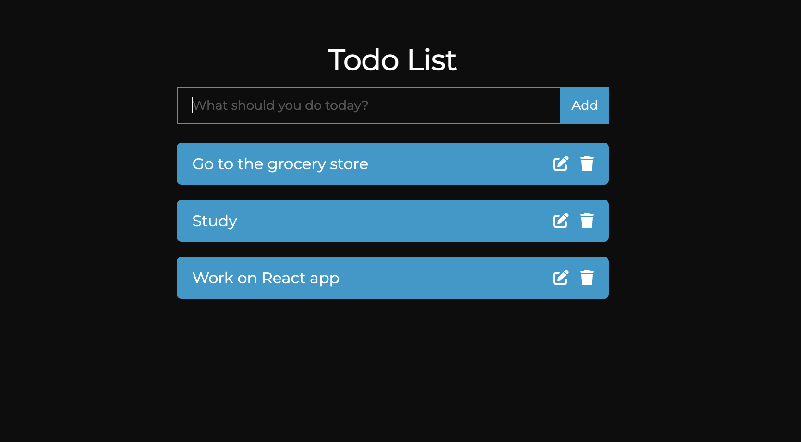

# React Todo Application

## Overview

A React todo application that allows user to add, edit, and delete todos. You can view a demo of the application [here](https://megancoyle.github.io/react-todo/).

## Technologies Used

- [React JS](https://reactjs.org/)

## Approach

## Installation

To run locally:

- `git clone` this repo and `cd` into the `directory` folder
- `npm i` to install dependencies
- `npm run start` to run the application locally

## Next Steps

- Setup a backend for the application